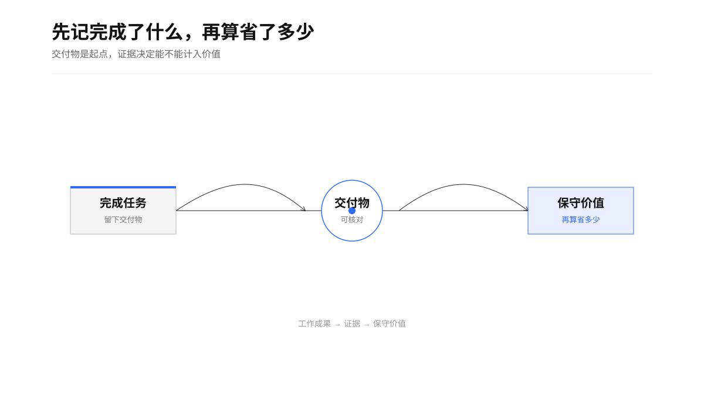
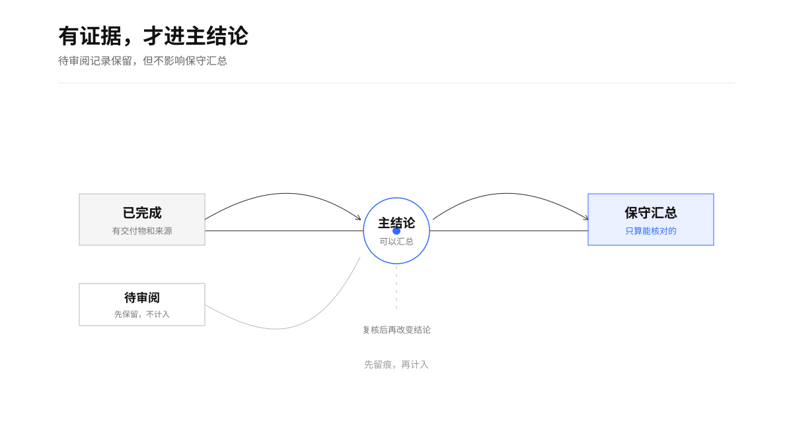
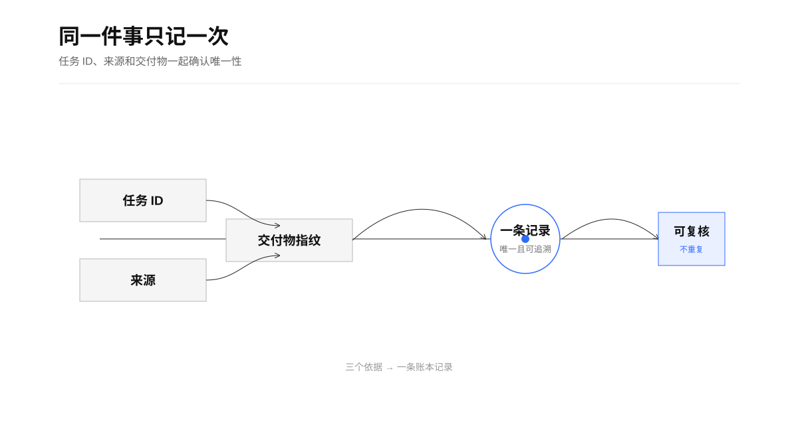

# 时间就是金钱｜AI's time is money

让 Agent 自己记录它为你完成了什么，以及这些工作大约替代了多少人工时间——再把省下的时间折算成钱。

## 它解决的问题

使用 Agent 一段时间后，最容易丢失的不是聊天记录，价值也不是简单的调用次数。真正容易丢失的是：

- 哪些工作已经完成并产生了交付物；
- 每项工作替代了多少原本需要亲自完成的整理、检索、写作、编码和复核；
- 哪些价值有证据，哪些只是推测；
- 多次对话、反复修改和延迟落盘的任务，怎样避免漏记或重复记账。

「时间就是金钱」把这些工作转成一份可复核的本地 Excel 账本。它记录的核心单位不是“调用了几次 AI”，而是“完成了一项什么工作，并留下了什么结果”。

<p align="center">
  
</p>

## 它的价值

### 让隐形产出变得可见

Agent 常常在一天里完成许多小而分散的工作：查资料、整理会议、清洗数据、写脚本、修问题、生成文档、发布工具。单次看都不惊人，累计起来却构成了真实的工作杠杆。

账本把这些分散产出按任务沉淀下来，形成时间、金额、类别和交付物的连续记录。

### 把“感觉很有用”变成可以讨论的证据

每项记录都保留任务 ID、来源、交付物、完成状态、估算假设和置信度。用户可以追问：这项工作到底完成了什么？原本人工要做多久？我自己实际参与了多少？

它不要求价值估算绝对精确，要求估算过程透明、口径稳定、可以被修正。

<p align="center">
  
</p>

### 帮助判断 Agent 应该继续做什么

持续记录后，可以看出 Agent 最适合承担哪些工作：

- 高重复、规则清楚的整理工作；
- 多来源读取、清洗和归并；
- 代码修改、测试、排障和发布；
- 长文档、报告和知识资产的持续维护；
- 需要回读、审计和断点恢复的自动化流程。

这比单纯追求“更多自动化”更接近实际决策：把 Agent 用在人工替代价值最高、结果最容易验证的地方。

### 让价值估算保持克制

账本默认只展示保守低值。中值和高值保留在 Excel 中，用于敏感性分析。

它明确区分：

- 人工反事实时间；
- 用户主动参与时间；
- 审核和返工时间；
- 可分摊的 Agent 成本；
- 已验证交付物与待审阅候选。

因此，账本给出的是“可审计的时间替代价值”，不把估算金额包装成现金收入、利润或确定收益。

## 工作方式

```text
扫描已完成工作
      ↓
识别交付物与完成状态
      ↓
按任务 ID / 来源 / 交付物指纹去重
      ↓
估算人工时间、用户投入和审核返工
      ↓
写入本地 Excel
      ↓
公式汇总、错误检查、待审阅标记
```

<p align="center">
  
</p>

每次默认回扫最近 7 天。这个窗口专门处理一个常见问题：会话已经完成，但摘要或交付物索引稍后才落盘。

## Excel 账本包含什么

- `汇总`：保守时间、保守金额、本周、本月和参考区间；
- `任务明细`：一行一项已完成任务，保存证据、假设和公式；
- `规则`：时薪、成本、时区、扫描回扫天数和任务分类；
- `运行状态`：最近扫描、成功写入、候选数和待审阅数量；
- `运行日志`：短事件和错误摘要，不保存完整聊天或敏感原文。

## 重要边界

- 只依赖本地 Excel，不依赖飞书、Base 或数据库；
- 不要求用户手工逐条填写；
- 没有完成证据的任务进入待审阅，不计入主结论；
- 代码行数、文件数量和 Agent 运行时长不能直接等价为节省时间；
- 不保存令牌、凭证、完整聊天、私密财务明细和不必要的个人信息；
- 公开发布前必须使用虚构示例，并完成敏感信息扫描。

## 快速开始

1. 安装或加载 `agent-value-ledger` Skill。
2. 运行 `scripts/doctor.sh --json`，确认模板和构建脚本可用。
3. 复制 `assets/agent-value-ledger-template.xlsx` 到你的本地工作目录。
4. 在 `规则` 工作表确认时薪、时区、默认成本和回扫天数。
5. 让 Agent 扫描已完成工作并更新 Excel。
6. 先审阅 `任务明细` 中的 `needs_review` 和低置信度记录，再使用 `汇总` 的保守主结论。

### Agent 使用说明

先运行 `scripts/doctor.sh --json`，再确认当前 Agent 能读取哪些会话摘要、任务记录、项目日志和交付物目录。来源不可访问时必须显式记录，不能推断为没有完成工作。写入用户工作簿后要回读新增行、汇总单元格和公式错误扫描；只写入文件不等于已验证。运行约定见 [`references/runtime.md`](references/runtime.md)。

## 适合谁

适合已经把 Agent 用于真实工作，并希望回答以下问题的人：

> Agent 到底替我完成了什么？
>
> 哪些价值有证据，哪些只是感觉？
>
> 下一步应该把更多工作交给 Agent，还是先补验证和边界？

## 当前状态

这是一个可审阅的早期版本。当前版本先解决“自动发现、保守估算、本地留痕和可复核”四件事；外部同步、团队协作和更复杂的成本分摊暂不内置。
